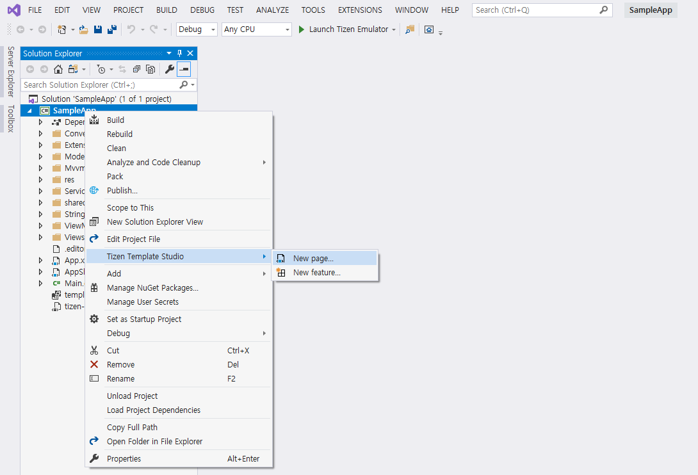
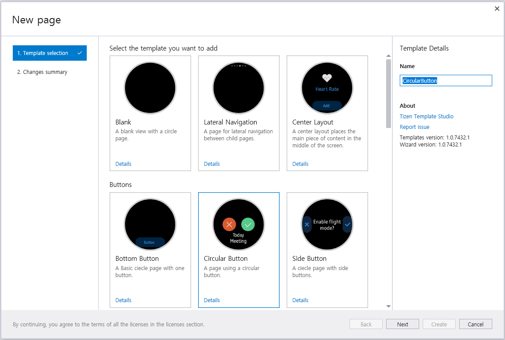
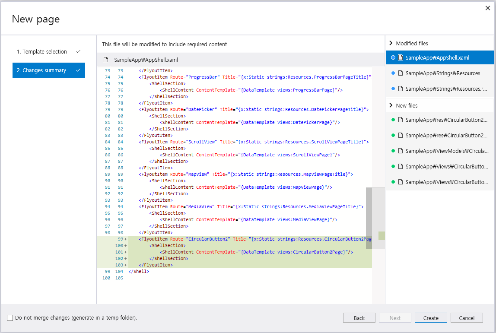
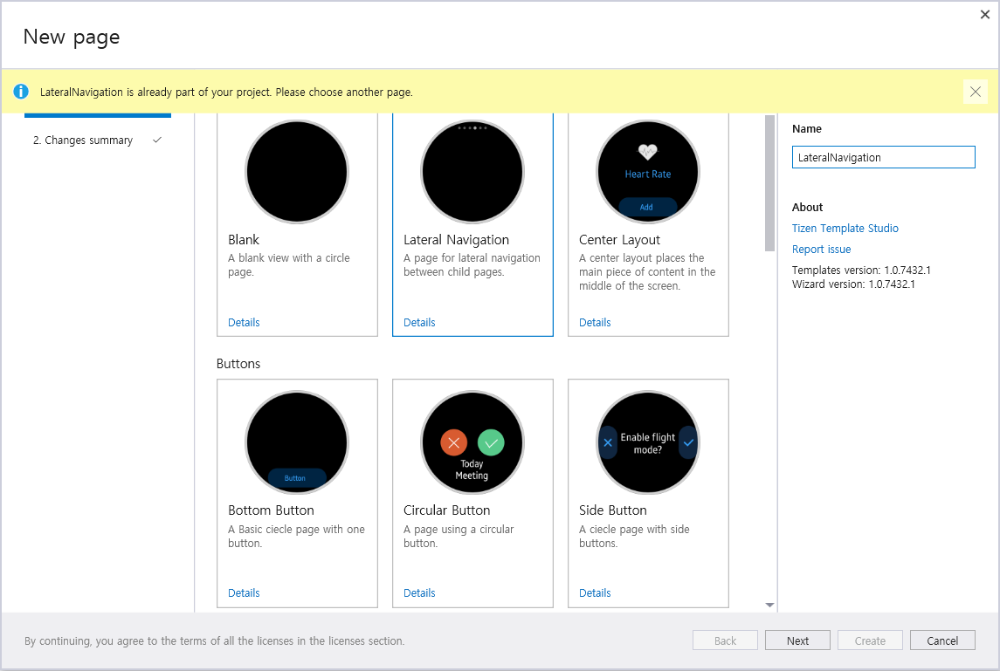
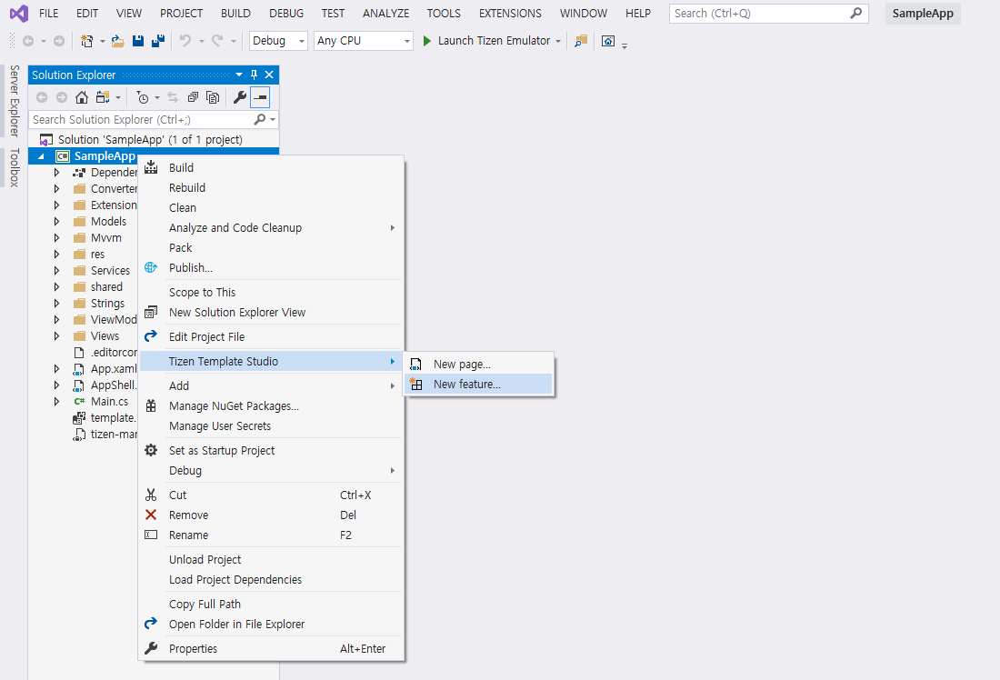
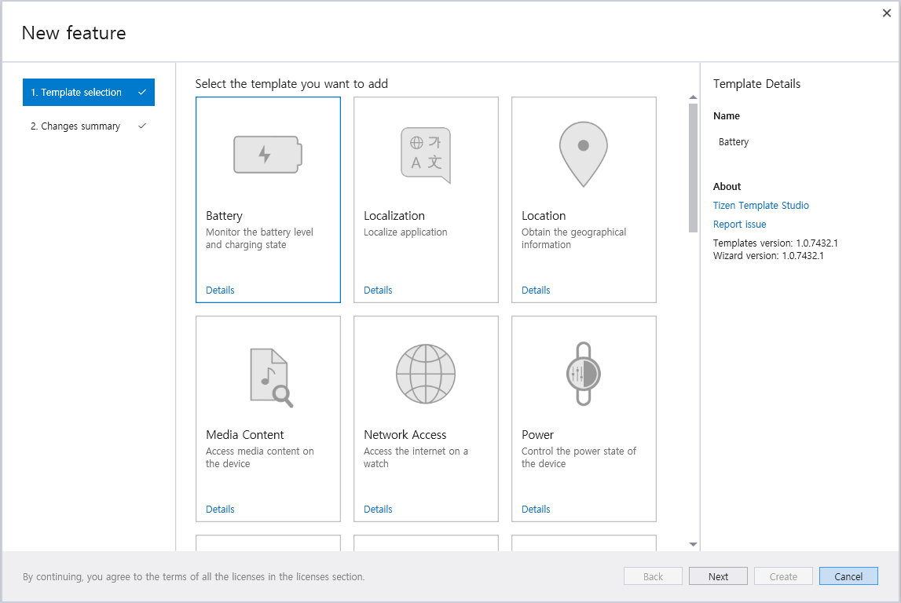
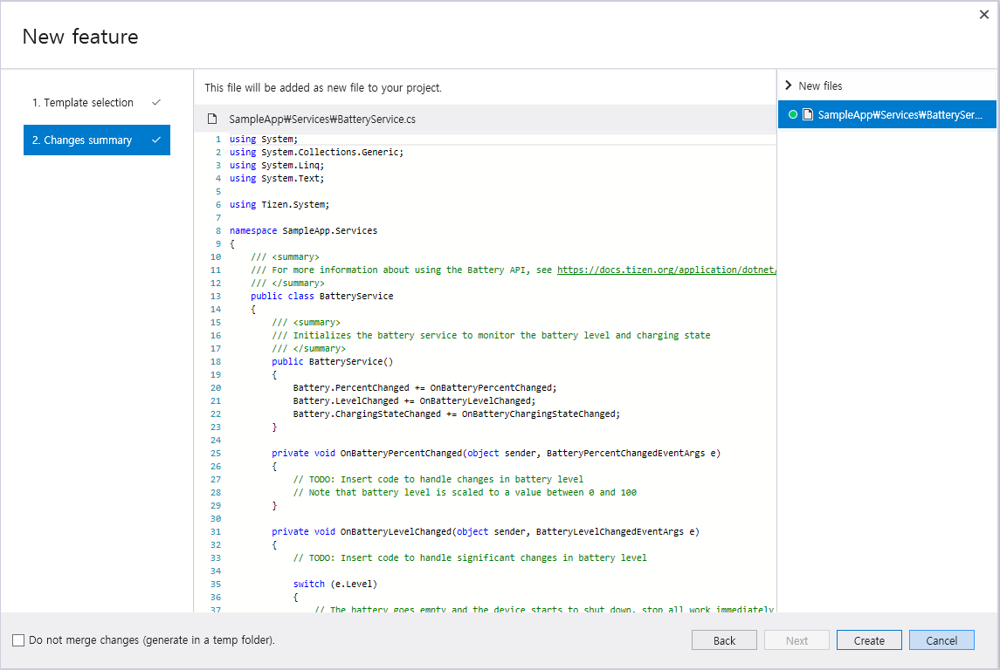
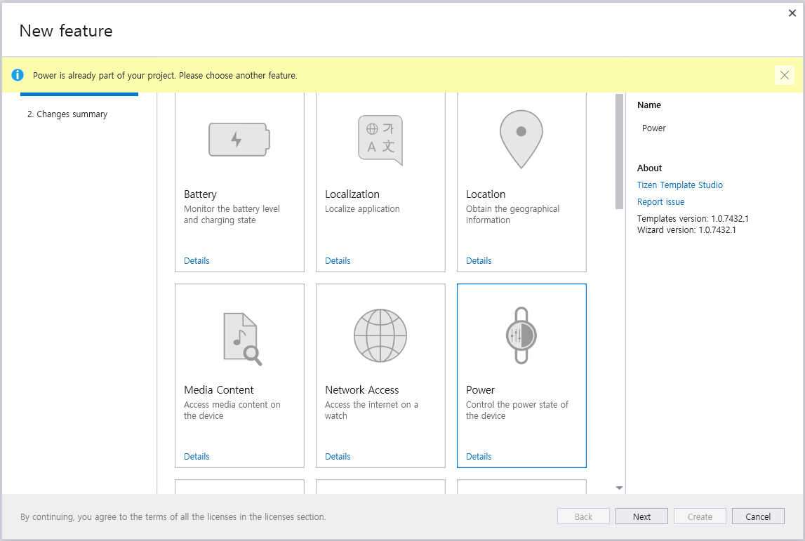

# Add page or feature in created project
Tizen Template studio supports to add <b>Pages</b> and <b>Features</b> within the created project. 

> You can only select one item from <b>Add Page</b> or <b>Add Feature</b>.

### Add Page
1. Select Project -> Right click -> Select <b>Tizen Template Studio</b> -> Select <b>New page</b>

2. Select a page to add. After selecting a page, you can edit the page name.

3. The selected page is added so you can see the newly added and modified files.

You can add page that is already in the project.
However, page name cannot be duplicated with existing names.

### Add Feature
1. Select Project -> Right click -> Select <b>Tizen Template Studio</b> -> Select <b>New feature</b>

2. Select a feature to add. 
Feature name cannot be changed.

3. The selected feature is added so you can see the newly added and modified files.

You cannot add feature already added to your project.

#### [Meet Tizen Template Studio](overview.md)
#### [Pages and Features](page-feature-list.md)
