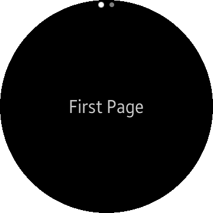
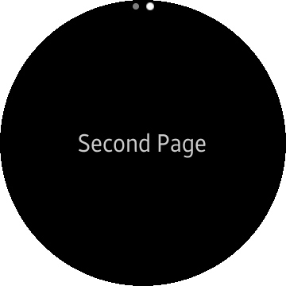

# AppShell.xaml
Tizen Template Studio creates Xamarin.Forms apps, that use **[Xamarin.Forms Shell](https://docs.microsoft.com/xamarin/xamarin-forms/app-fundamentals/shell/)** for navigation in the app.
Your app doesn't have to follow a set navigation hierarchy, and can navigate to any page in the app with URI-based navigation scheme.

```xml
<?xml version="1.0" encoding="utf-8" ?>
<Shell
    x:Class="SampleApp.AppShell"
    xmlns="http://xamarin.com/schemas/2014/forms"
    xmlns:x="http://schemas.microsoft.com/winfx/2009/xaml"
    xmlns:strings="clr-namespace:SampleApp.Strings"
    xmlns:views="clr-namespace:SampleApp.Views">
    <FlyoutItem Route="Main" Title="MainPage">
        <ShellSection>
            <ShellContent ContentTemplate="{DataTemplate views:MainPage}"/>
        </ShellSection>
    </FlyoutItem>
    <FlyoutItem Route="LateralNavigation" Title="LateralNavigation">
        <ShellSection>
            <ShellContent ContentTemplate="{DataTemplate views:LateralNavigationPage}"/>
            <ShellContent ContentTemplate="{DataTemplate views:LateralNavigationSecondPage}"/>
        </ShellSection>
    </FlyoutItem>
    <FlyoutItem Route="CenterLayout" Title="CenterLayoutPage">
        <ShellSection>
            <ShellContent ContentTemplate="{DataTemplate views:CenterLayoutPage}"/>
        </ShellSection>
    </FlyoutItem>
    <FlyoutItem Route="SideButton" Title="SideButtonPage">
        <ShellSection>
            <ShellContent ContentTemplate="{DataTemplate views:SideButtonPage}"/>
        </ShellSection>
    </FlyoutItem>
</Shell>
```
The pages contained in `Shell` are mapped to `ShellContent` elements.

Normally, a page occupies the entire screen area in watch device, so `ShellSection` contains one `ShellContent` in many cases.

  

If you want to arrange multiple pages horizontally, then add a set of `ShellContent` in a `ShellSection` like:
```xml
<ShellSection>
    <ShellContent ContentTemplate="{DataTemplate views:LateralNavigationPage}"/>
    <ShellContent ContentTemplate="{DataTemplate views:LateralNavigationSecondPage}"/>
</ShellSection>
```
Then, a set of `ShellContent` is displayed as you want.

```xml
<FlyoutItem Route="Main" Title="MainPage">
```
An important element of page navigation is `Route` in `Shell` navigation.
You can move pages based on `Route`.
`Title` is displayed as a label on the screen.
> `Route` and `Title` are also available in `ShellSection`.

```cs
public async void GotoCenterLayout()
{
    await Shell.Current.GoToAsync("CenterLayout");
}
```
You can move the page directly using the `GoToAsync` method and `Route`.

For more information about how to navigate using `Shell` in watch application, see [Using Xamarin.form Shell on Galaxy Watch](https://developer.samsung.com/tizen/blog/en-us/2020/03/09/using-xamarinform-shell-on-galaxy-watch)

---

- [Meet Tizen Template Studio](overview.md)

