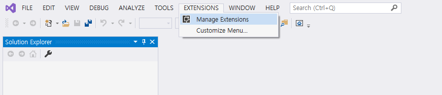
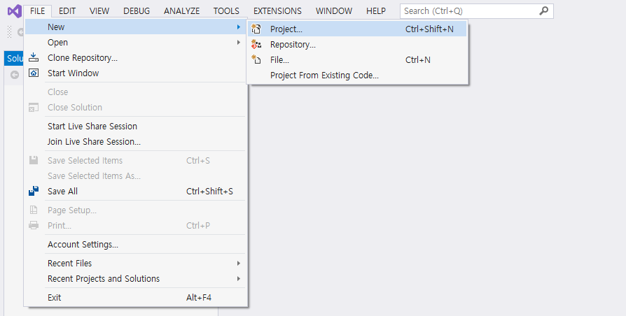
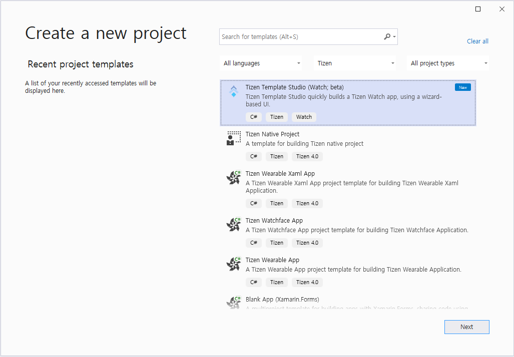
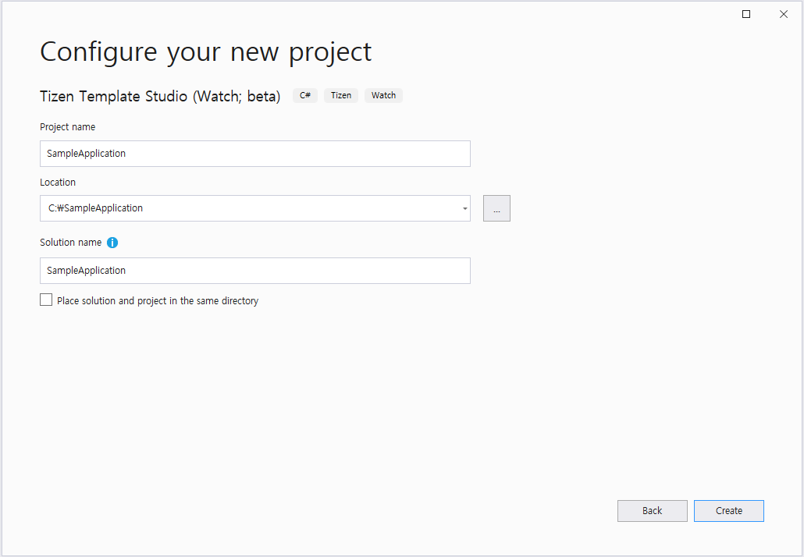

# Install Tizen Template Studio
Tizen Template Studio is a Visual Studio 2019 Extension. You can simply download and install through the **Manage Extensions** menu on your Visual Studio 2019.

## Prerequisites
Before you install the extension, you must have an environment for developing Tizen .NET apps.
For more information, see [Installing Visual Studio Tools for Tizen](https://docs.tizen.org/application/vstools/install)
* Visual Studio 2019
* Visual Studio Tools for Tizen
* Tizen Baseline SDK

## Installation steps

#### 1. Start Manage Extensions in Visual Studio
Launch Visual Studio 2019 and select **EXTENTIONS > Manage Extensions**

#### 2. Search Tizen Template Studio.
In the **Manage Extensions** window, search and download Tizen Template Studio.
> You can easily search by entering **Tizen** in the search text box.

Tizen Template Studio will be installed after all instances of Visual Studio have been closed.

#### 3. Create new project
After you've installed Tizen Template Studio, launch Visual Studio 2019 and select **FILE > New > Project**.

#### 4. Select project template
Select **Tizen Template Studio** template.
> The template is placed at the top with the `New` tag.

#### 5. Configure project
Set **Project name**, **Location** and **Solution name**, and then click **Create** to start Tizen Template Studio.

---

- [Meet Tizen Template Studio](overview.md)
