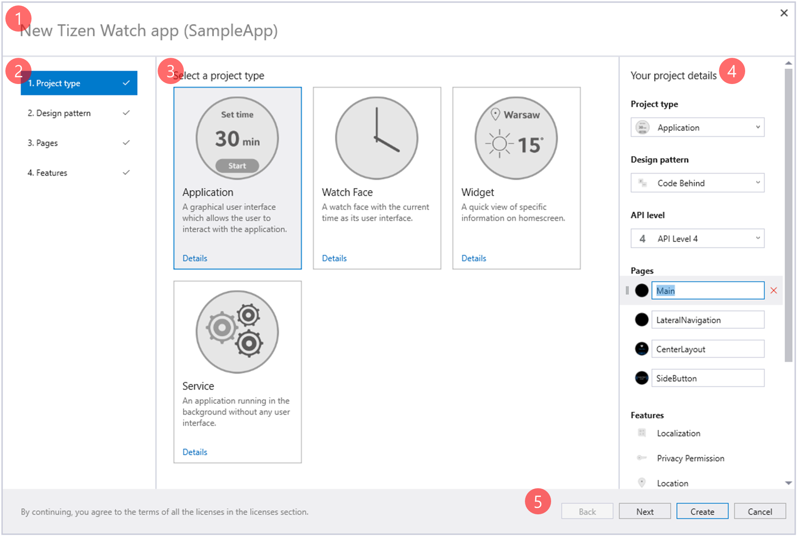
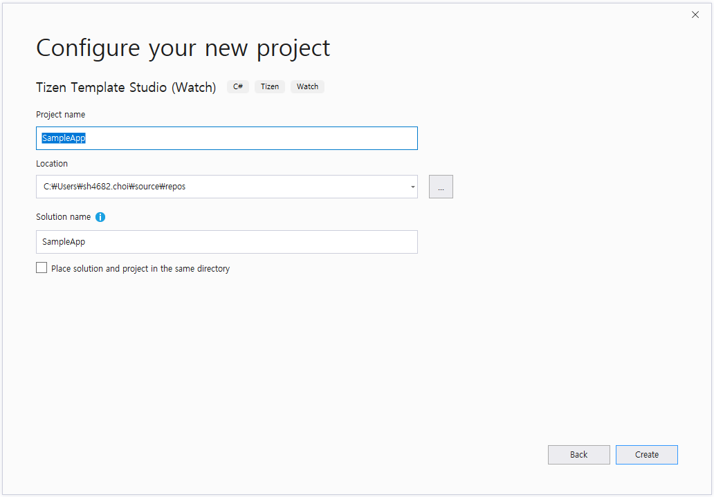
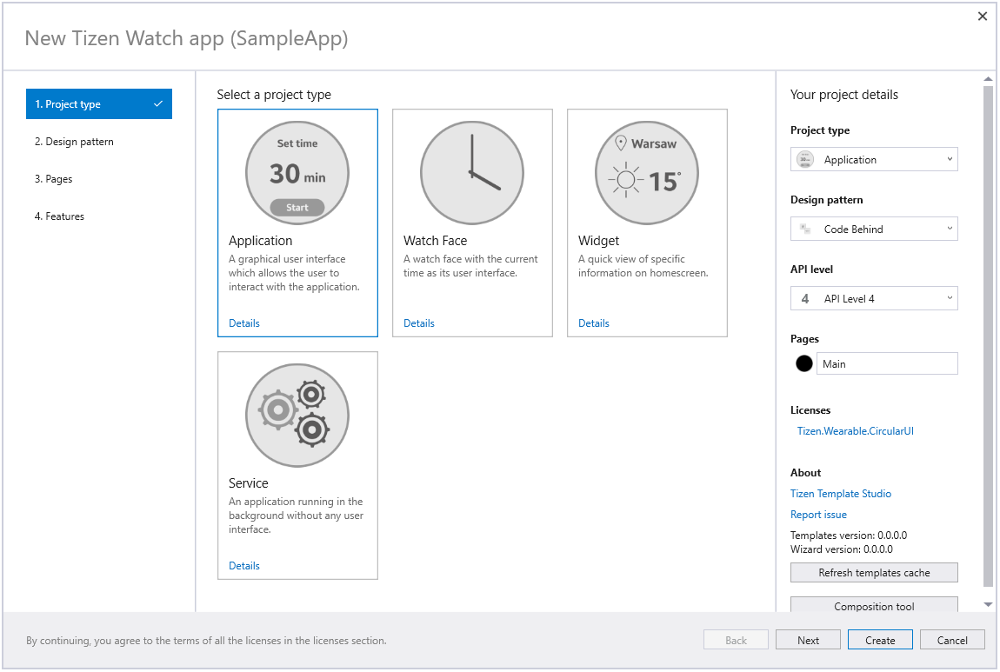
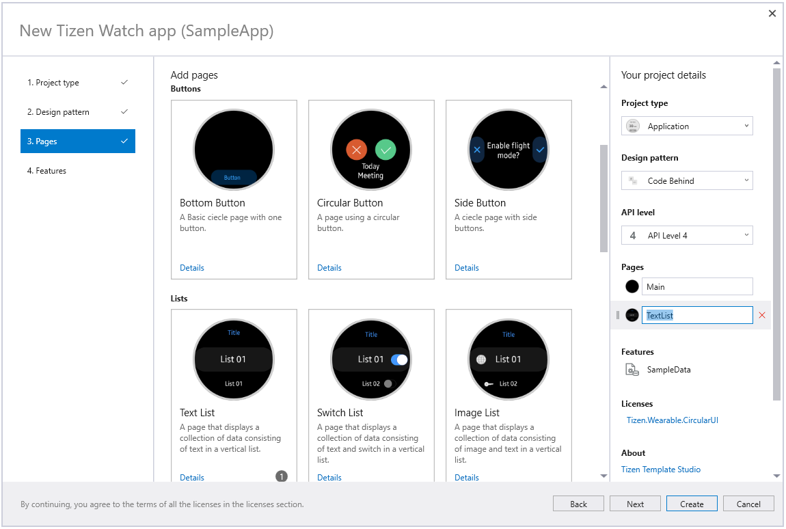
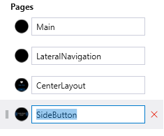
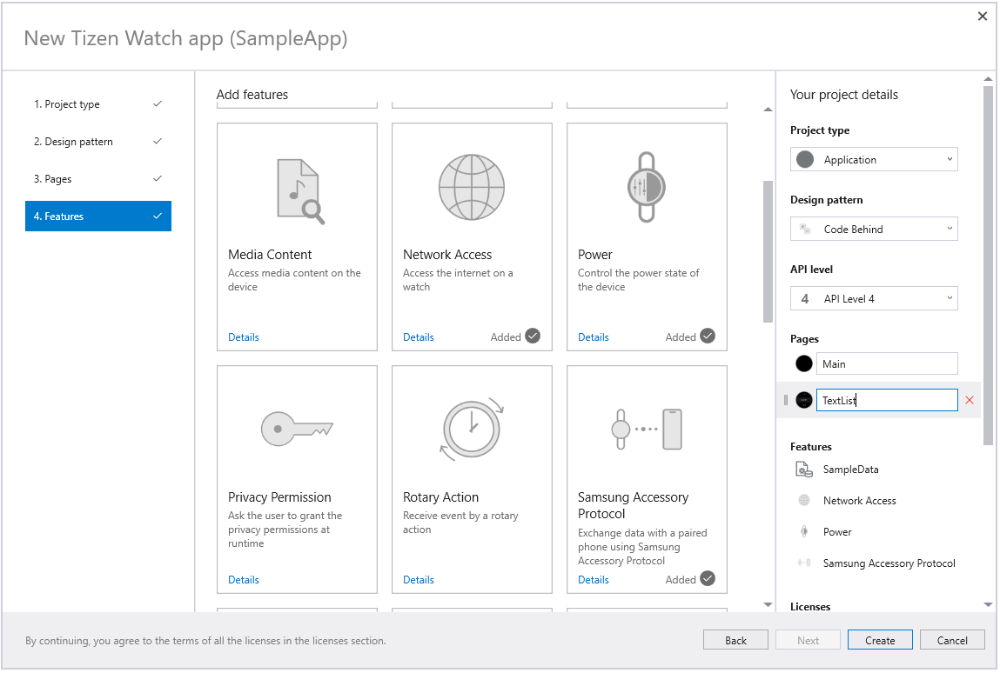
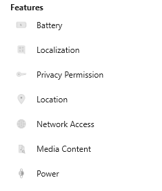
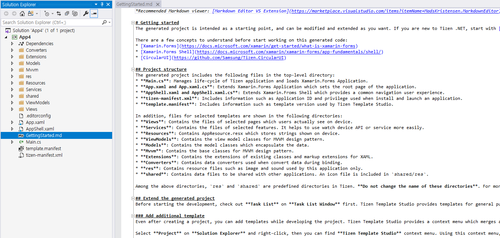
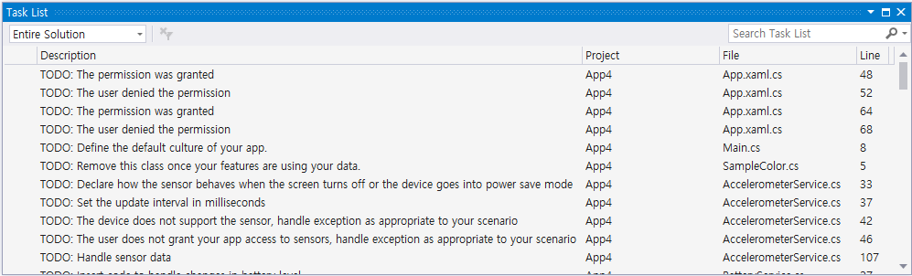

# Meet Tizen Template Studio
Tizen Template Studio is a Visual Studio 2019 Extension that uses a wizard to help you create a Tizen .NET app.
You can start creating a new project easily by selecting the type of project you want to create and well-defined templates.
Templates provide starter code for building Tizen .NET apps and help you develop UI and commonly used features quickly.

Tizen Template Studio currently supports the creation of Tizen .NET apps running on Samsung Galaxy Watch.
Templates are designed to help you write apps optimized for Galaxy Watch using **Xamarin.Forms** and **CircularUI**.
* [Xamarin.Forms](https://docs.microsoft.com/xamarin/get-started/what-is-xamarin-forms) is a cross-platform UI toolkit for build user interfaces in Tizen .NET apps.
* [Xamarin.Forms Shell](https://docs.microsoft.com/xamarin/xamarin-forms/app-fundamentals/shell/) is a container for navigation and performance improvements in Tizen .NET apps.
* [CircularUI](https://github.com/Samsung/Tizen.CircularUI) is a set of extension APIs of Xamarin.Forms and helps you easily and efficiently create Tizen wearable-specific user interfaces.

The created project uses **Xamarin.Forms Shell**, so you can easily implement navigation in your app. For more information on using Xamarin.Forms Shell, see [AppShell.xaml](app-shell.md).

## Install Tizen Template Studio
Tizen Template Studio is a Visual Studio 2019 Extension. You can simply download and install through the **Manage Extensions** menu on your Visual Studio 2019.
For more details, see **[Install Tizen Template Studio](install-tizen-template-studio.md)**

## User interface

  1. The **title bar** displays the project name.
  2. The **menu window** provides 4 menus. Selecting each menu changes the item window.
  3. The **item window** displays a list of items that are provided in the each menu.
  4. The **project details window** displays the project configuration you select.
  5. The **navigation bar** provides navigation buttons.

## Create a project with Tizen Template Studio
You can quickly and easily create a project by selecting the project type and combining various pages and features. The created project can be edited and you can create the desired application by referring to the provided code.

### 1. Launch Tizen Template Studio
Set project name, solution name and project location.

Click **Create** for launching Tizen Template Studio.

### 2. Select project type
Tizen Template Studio supports various project types such as Application, Watch Face, Widget, and Service.

 - The **application** provides a graphical user interface for users to interact with a basic UI application.
 - The **watch face** is a specialized application that displays the current date and time on the screen.
 - The **widget** is a specialized application that provides a quick view of specific information from the parent application.
 - The **service** is an application runs in the background without any user interface.
> When the project type changes, the available pages also change.

### 3. Select design pattern
Tizen Template Studio recommends using design patterns.
The project folder structure will be changed according to the selected design pattern.

 - The **Code Behind** is the most basic model that handles logic in the code-behind.
 - The **[Model-View-ViewModel(MVVM)](https://en.wikipedia.org/wiki/Model%E2%80%93view%E2%80%93viewmodel)** provides a separation of user interface development from business logic or back-end logic development.

### 4. Select pages
Tizen Template Studio provides various pages templates that are widely used in the watch application.
A list of provided pages is displayed and you can select the desired pages.

Multiple selection of the same page is possible.
The selected pages are automatically added to the project.

 
The selected pages are displayed in the **project detail window** and each page can be deleted or renamed.

### 5. Select features
Tizen Template Studio provides various feature templates that are widely used in the watch application. They show how to use [TizenFX](https://samsung.github.io/TizenFX/stable/api/) with .NET API.

Each feature cannot be selected in duplicate nor renamed.

The selected features can be displayed and deleted in the **project details window**.

> You can find the provided pages and features in [Pages and Features](page-feature-list.md).

### 6. Create project
Once selection finished, click **Create** to create the project.
Tizen Template Studio creates your new project with code and resources to help you get started.

**GettingStarted.md** file is opened automatically, which describes the project structure and added files.
We encourage you to check out the guide for details on the project before you start.

You can find a list of **TO-DO** items in the **Task List Window**.
Add the desired function to the application by referring to the description of **TO-DO**.

## Add page or feature in created project
Even after creating a project, you can add templates while developing the project.
For more details, see **[Add page or feature in created project](add-page-feature.md)**

## Limitation
Tizen Template Studio supports only Visual Studio 2019

