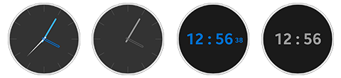

A watch face is a specialized application that displays the current date and time on the screen.

Watch face can be in the shape of a traditional watch such as digital and analog one, or in a completely different shape or form.

In ambient mode, the watch face needs to show a limited UI to reduce power consumption.

For more details, see [Watch Application Guide](https://docs.tizen.org/application/dotnet/guides/applications/watch-app) and [Watch Face Design](https://developer.samsung.com/galaxy-watch-design/watch-face/overview.html).